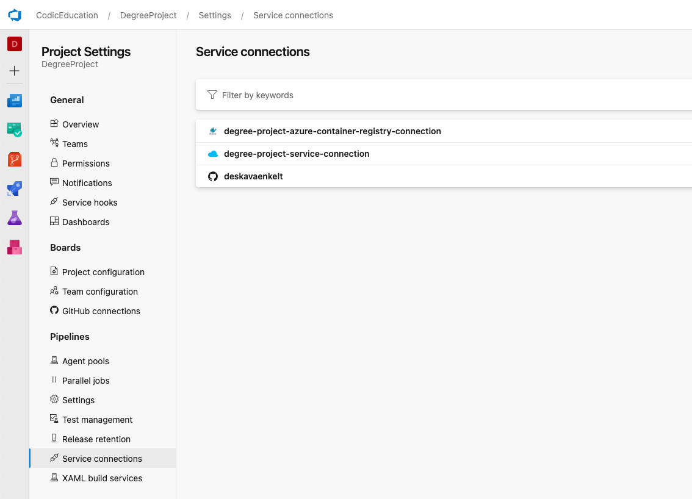

# DegreeProject

## Table of Contents

- [DegreeProject](#degreeproject)
    - [Table of Contents](#table-of-contents)
    - [Project Plan](#project-plan)
        - [Purpose](#purpose)
        - [Problem formulation](#problem-formulation)
        - [Method](#method)
    - [Problem solving](#problem-solving)
        - [Step 1 - Foundation](#step-1---foundation)
        - [Start commands](#start-commands)
        - [Getting started Script](#getting-started-script)
    - [Azure](#azure)
    - [Azure DevOps](#azure-devops)

## Project Plan

### Purpose

My idea is to create a full stack project with the MERN stack (MongoDB, Express.JS, React, NodeJS), written in
TypeScript which will then be entered into a CI/CD flow. Docker will be used to run the entire application in containers
that can be easily updated and scaled up and down as needed. This also places demands on a proper construction
environment as TypeScript must be compiled down to JavaScript before it can be used.

It would also be good if you could create a setup script that can be run to set up the environment for new developers, a
so-called on-boarding script that solves environmental variables and which starts up a development database for the
project.

The idea is to work according to DevOps principles where a project is taken from start with coding in development to
production operation.

### Problem formulation

As DevOps is defined differently depending on whom you ask and which company you come to, I take into account the
definition “a developer who can put the code it produces in a pipeline so that the code can be tested before the code
goes into operation and thus the developer takes responsibility for the code it produced ”.

The reason why I want to take this focus is because it fits well with my background in full stack development (web
development). It is also the usual path that code takes from start to finish when working according to DevOp's
principles according to the context I have chosen.

The problem that will be solved is to develop a standard web application from the ground up and put it into operation in
sharp mode.

### Method

I will start by developing the application locally on my computer, where a simple skeleton is built to then add Docker
functionality with Docker files and Docker-Compose. When everything Docker related works on a clean project, the work
will continue to create the application and write tests that will be needed for later steps in the CI flow. For example,
the TypeScript compilation to JavaScript must work before there is any idea to even try to develop the application.

When the foundation is laid with a few simple tests on the frontend and backend, the CI / CD chain will be built.

When there is then a flow all the way from code to test's that can be published online, the application itself with all
the functionality will be built.

Backend will have full API tests on all functionality to ensure quality before Frontend can be implemented. Frontend
will have some unit tests as well as function tests to, for example, verify login.

## Problem solving

### Step 1 - Foundation

1. Create new GitHub project `DegreeProject`
2. Add .gitignore
3. Create React Frontend with TypeScript
    - `npx create-react-app client --template typescript`
    - Added libraries as needed
4. Create Server (API) with Express and TypeScript
    - `npm init --yes`
    - `npm i express && npm i --save-dev typescript ts-node-dev @types/express @types/node`
    - Added more libraries as needed
5. Create a simple Rest-endpoint that will respond on a port that the server is up and running. Then connect to the
   server via React frontend and verify on both sides:
    - `npm run build`
    - `npm test`
    - `npm start`
6. Create Docker files for backend and frontend to get the two containers to talk to each other.
    - One file for development environment
    - One file for production environment
    - Docker-compose for both:
        - Development `docker-compose -f docker-compose.dev.yml up`
        - Production `docker-compose -f docker-compose.prod.yml up`
        - If a rebuild is needed, add `--build` to the command
7. Refactor the docker-compose files to use best practices and to be more readable.

### Start commands

- Build: `npm run build`
- Start server: `npm start`
- Run tests: `npm test`

### Getting started Script

Run the script in the folder where the project should locate.

```shell
curl -o gettingStartedScript.sh https://raw.githubusercontent.com/deskavaenkelt/DegreeProject/main/gettingStartedScript.sh
sh gettingStartedScript.sh
```

## Azure

1. Create a Azure account

2. Create a `Storage Account`
    - Resource group: `degreeProjectAzure`
    - Storage account name: `degreeprojectstorage`
    - Location: `North Europe`
    - Subscription: `Subscription09`
    - Performance: `Standard`
    - Replication: `Read-access geo-redundant storage (RA-GRS)`
    - Account kind: `StorageV2 (general purpose v2)`
    - Create

3. Create a Container registry
    - Subscription: `Subscription09`
    - Resource group: `degreeProjectAzure`
    - Registry name: `degreeprojectregistry`
    - Location: `North Europe`
    - Sku: `Basic`
    - Login server: `degreeprojectregistry.azurecr.io`
    - Create

4. Create Access keys
    - Go to Resource container registry `degreeprojectregistry` and click on `Access keys`
    - Admin user: Enable
    - Copy credentials to separate file

5. Repository's
    - Deployed registries will show up here.

6. Create A Azure Cosmos DB API for MongoDB
    - Resource group: `degreeProjectAzure`
    - Database name: `degreeprojcectcosmosdb`
    - Location: `North Europe`
    - Review and Create

## Azure DevOps

### Create new Project

- Project name: `DegreeProject`
- Description: `My examination Project`
- Visibility: `Private`
- Advanced =>
    - Version control: `Git`
    - Work item process: `Agile`
- Create

### Import GitHub Repository

1. Click on Repos in the left menu.
2. Click on **DegreeProject.git** and **Import Repository**.
3. Select **DegreeProject** and click **Import**.

### Configure the CI Pipeline

#### Create Service connections

1. Connect to GitHub repository
    - New service connection: GitHub
    - Follow instructions

2. Connection to repository
    - New service connection: `Azure Resource Manager`
    - Service principal (automatic)
    - Scope level: Subscription
    - Subscription: Subscription9
    - Resource group: `degreeProjectAzure`
    - Service connection name: `degree-project-service-connection`
    - Security: [x] Grant access permission to all pipelines
    - Save

3. Connection to Docker Registry
    - New service connection: `Docker Registry`
    - Registry type: `Azure Container Registry`
    - Subscription: `Subscription9`
    - Azure container registry: `degreeprojectregistry`
    - Service connection name: `degree-project-azure-container-registry-connection`
    - Security: [x] Grant access permission to all pipelines
    - Save



#### Create Pipelines (Classic Automated)

- Library
    - New Variable Group: `Production`

- Create Pipeline
    - Use the classic editor to create a pipeline without YAML.
    - Source: `GitHub`
        - Repository: `DegreeProject`
        - Default Branch: `main`
        - Continue
        - Template: `Empty Job`
        - Continue
    - Tasks:
        - PipeLine
            - Name: `DegreeProject-CI-Server`
            - Agent pool: `Azure Pipelines`
            - Agent specification: `ubuntu-latest`
            - Add job: `npm`
                - Display name: `npm install`
                - Command: `npm install`
                - Working folder that contains `package.json`: `server`
            - Add job: `npm test`
                - Display name: `npm test`
                - Command: `custom`
                - Working folder that contains `package.json`: `server`
                - Command and arguments: `test`
            - Add job: `Publish Artefact: drop`
                - Display name: `Publish Artefact`
                - Path to publish: `$(Build.SourcesDirectory)`
                - Artifact name `drop`
                - Artifact publish location: `Azure Pipelines`
            - Save and Queue

      - Build an image
          - Azure subscription: `degree-project-service-connection`
          - Azure Container Registry: `degreeprojectregistry`
          - Docker File: `server/Dockerfile.prod`
          - Tags: Change to `latest`
      - Push an image
          - Azure subscription: `degree-project-service-connection`
          - Azure Container Registry: `degreeprojectregistry`
          - Tags: Change to `latest`
    - Save & Queue
    - Save commit: DevOps-build-process
    - Save and run

#### Create an App Service

- In Azure Portal
    - Click on **App Service**
    - Click on **Create**
    - Subscription: `Subscription9`
    - Resource group: `degreeProjectAzure`
    - Name: `degree-project-server`
    - Publish: `Code`
    - Runtime stack: `Node 16 LTS`
    - Operating system: `Linux`
    - Region: `North Europe`
    - App Service Plan: `degreeprojectlinuxplan (F1)`
    - Next > Create
- In Azure DevOps
    - Click on **Pipelines**
    - Click on **Releases**
    - New Pipeline
    - Empty job
        - Stage name: `Deploy Backend`
        - Name on pipeline: `DegreeProject CD pipline`
    - Add Artefact
        - Project: `DegreeProject`
        - Source (Build pipeline): `DegreeProject-Server-CI-Pipeline`
        - Default version: `Latest`
        - Source Alias: `_DegreeProject-Server-CI-Pipeline`
    - Enable CD on lightning icon
        - Add
        - Build branch filters
        - Type: `include`
        - Build branch: `main`
        - Save
    - Add task to `Deploy Backend`
        - Add
        - Azure App Service Deploy
        - Display name: `Azure App Service Deploy: DegreeProject Server`
        - Connection type: `Azure Resource Manager`
        - Azure subscription: `degree-project-service-connection`
        - App Service type: `Web App on Linux`
        - App Service name: `degree-project-server`
        - Package or folder: `$(System.DefaultWorkingDirectory)/_DegreeProject-Server-CI-Pipeline/drop/server`
    - 


